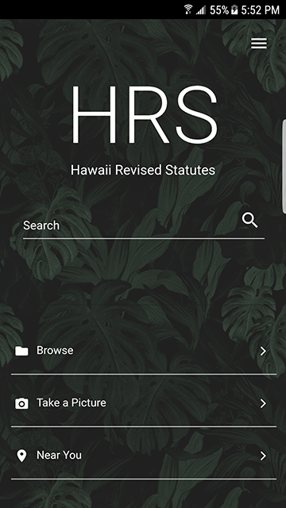
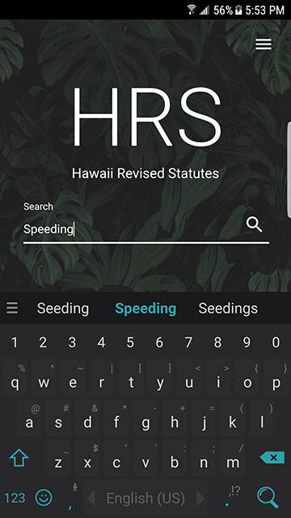
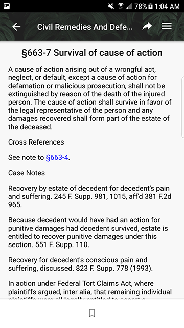

# The HRS App
*More than just a search engine.*

When we designed and implemented this application, we wanted to make this more than a traditional search. We wanted to create an app that could effectively search the current Hawaii Revised Statutes in a way that was new and innovative. Our goal for this app was to echo the very essence of being more than a search engine. As result, we created a new experience for the user. 

The HRS App takes into account the following issues:

* Can't effectively search the current HRS.
* Can't find cross references in the HRS.
* Difficult to search for statutes located on signs around Hawaii.
* Not knowing what laws are relavant to your location.
* Having to note down laws you reference daily. 

## What we built
The very core of our application is a search engine, but in addition to that, we integrated tools that the user utilizes on a daily basis. As part of the application, we made use of optical recognition and location to further enhance the search experience. Instead of having to type the chapter and section of a statute, I could instead take a picture of it and get the result on my phone. Instead of manually figuring out what laws are relevant to my area, wtih a click of a button, I can see the laws nearest to my location. When we built this, we made sure to create an app at the highest level of quality. Our hope is for this app to become part of everyones lives when making legal decisions.

## Running the app
After opening the app, you are first welcomed with the homepage:

From there, you are able to do a general search, browse the HRS, take a picture, or search nearby laws.
### Search
Using search is very easy. Just type in a term you are looking for, a chapter, section, or both chapter and section. The search engine will do its best to return the closest results.

Here's an example:

Searching for 'speeding' yields results related to speeding.

### Browse
When opening browse, you will reveal the list of divisions within the HRS.

From there, you can browse through the divisions, titles, chapters, and sections.

Here is what a section may look like

Here, you can see the information about the statute.

In some sections, you may see a cross reference to another statute like this.

You can select it to reveal information about it as well.

### Taking a Pic
This feature allows the user to quickly snap a photo on their mobile device and our image recognition software will redirect the user to a found statute.

### Searching nearby Laws
## Installation
Select the 'client' or 'server' directory to see respective installation instructions.
## About HRS App development
The HRS App was developed as part of the [2017 Hawaii Annual Code Challenge](http://hacc.hawaii.gov).

During the hackathon, the team included:

  * [Jonathan Robello](https://www.linkedin.com/in/jonathan-robello/)
  * [Terry Palomares](https://www.linkedin.com/in/terry-palomares/)
  * [Chris Oh](https://www.linkedin.com/in/christopher-oh-9a1135133/)
  * [Dan Paguirigan](https://www.linkedin.com/in/danpaguirigan/)
